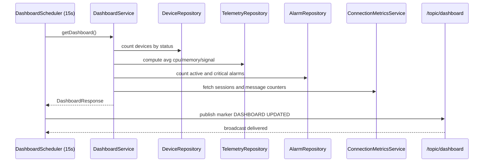

# Diagram 5 - Dashboard Update Flow

```mermaid
sequenceDiagram
    participant DS as DashboardScheduler (15s)
    participant DSV as DashboardService
    participant DEV as DeviceRepository
    participant TEL as TelemetryRepository
    participant ALR as AlarmRepository
    participant MET as ConnectionMetricsService
    participant TOP as /topic/dashboard

    DS->>DSV: getDashboard()
    DSV->>DEV: count devices by status
    DSV->>TEL: compute avg cpu/memory/signal
    DSV->>ALR: count active and critical alarms
    DSV->>MET: fetch sessions and message counters
    DSV-->>DS: DashboardResponse
    DS->>TOP: publish marker DASHBOARD UPDATED
    TOP-->>DS: broadcast delivered
```
