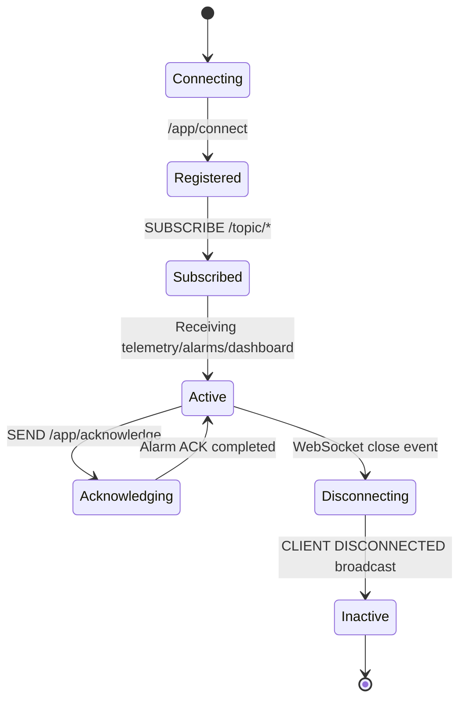

# Diagram 6 - Connected Client Lifecycle

```mermaid
stateDiagram-v2
    [*] --> Connecting
    Connecting --> Registered: /app/connect
    Registered --> Subscribed: SUBSCRIBE /topic/*
    Subscribed --> Active: Receiving telemetry/alarms/dashboard
    Active --> Acknowledging: SEND /app/acknowledge
    Acknowledging --> Active: Alarm ACK completed
    Active --> Disconnecting: WebSocket close event
    Disconnecting --> Inactive: CLIENT DISCONNECTED broadcast
    Inactive --> [*]
```
