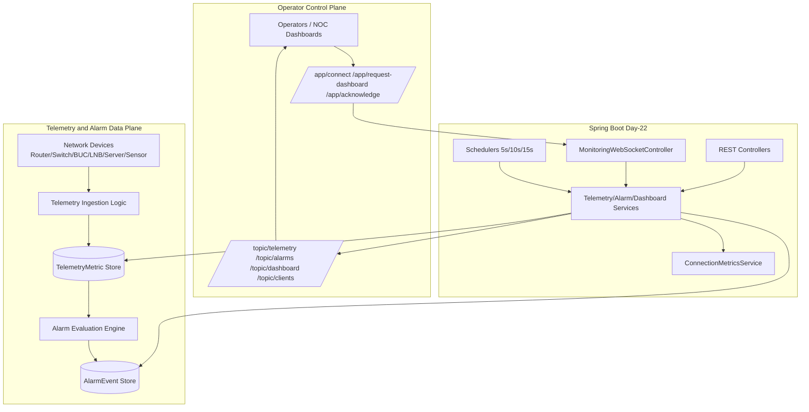

# Diagram 7 - Real-Time Monitoring Architecture

```mermaid
graph TB
    subgraph DataPlane[Telemetry and Alarm Data Plane]
      DEV[Network Devices\nRouter/Switch/BUC/LNB/Server/Sensor]
      DEV --> ING[Telemetry Ingestion Logic]
      ING --> MET[(TelemetryMetric Store)]
      MET --> AE[Alarm Evaluation Engine]
      AE --> AL[(AlarmEvent Store)]
    end

    subgraph ControlPlane[Operator Control Plane]
      OP[Operators / NOC Dashboards]
      OP --> WSIN[/app/connect /app/request-dashboard /app/acknowledge/]
      WSOUT[/topic/telemetry /topic/alarms /topic/dashboard /topic/clients/]
      WSOUT --> OP
    end

    subgraph AppCore[Spring Boot Day-22]
      REST[REST Controllers]
      WSC[MonitoringWebSocketController]
      SCH[Schedulers 5s/10s/15s]
      SVC[Telemetry/Alarm/Dashboard Services]
      OBS[ConnectionMetricsService]
    end

    SCH --> SVC
    SVC --> MET
    SVC --> AL
    SVC --> WSOUT
    WSC --> SVC
    WSIN --> WSC
    REST --> SVC
    SVC --> OBS
```
