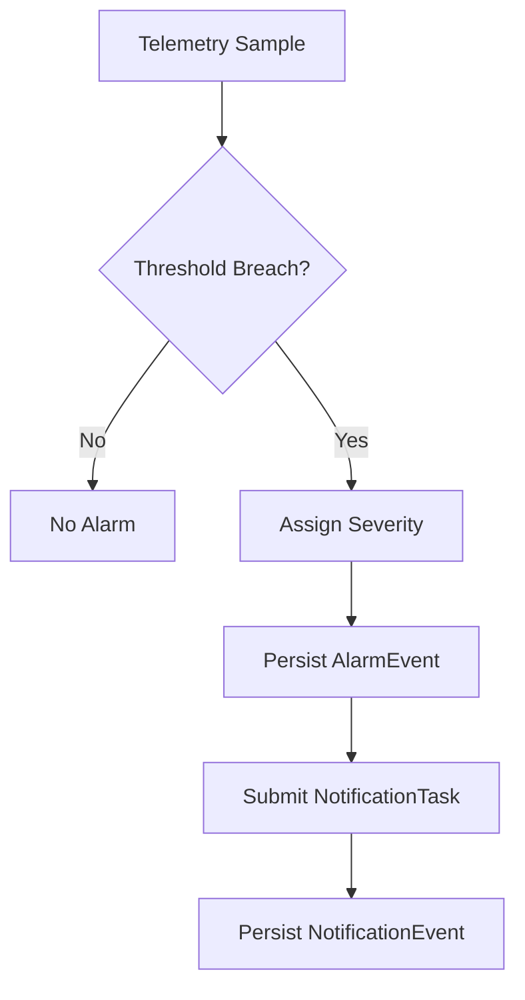

# Alarm Processing Flow

```mermaid
flowchart TD
    IN[Telemetry Sample] --> RULE{Threshold Breach?}
    RULE -- No --> EXIT[No Alarm]
    RULE -- Yes --> SEV[Assign Severity]
    SEV --> SAVE[Persist AlarmEvent]
    SAVE --> SUBMIT[Submit NotificationTask]
    SUBMIT --> SENT[Persist NotificationEvent]
```
