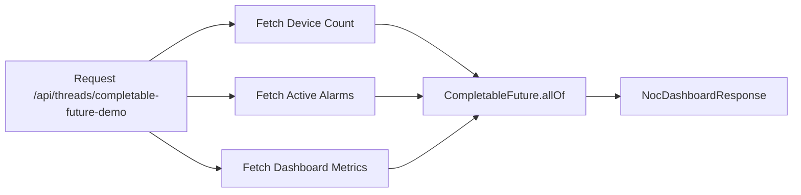

# CompletableFuture Flow

```mermaid
flowchart LR
    START[Request /api/threads/completable-future-demo] --> F1[Fetch Device Count]
    START --> F2[Fetch Active Alarms]
    START --> F3[Fetch Dashboard Metrics]
    F1 --> JOIN[CompletableFuture.allOf]
    F2 --> JOIN
    F3 --> JOIN
    JOIN --> OUT[NocDashboardResponse]
```
