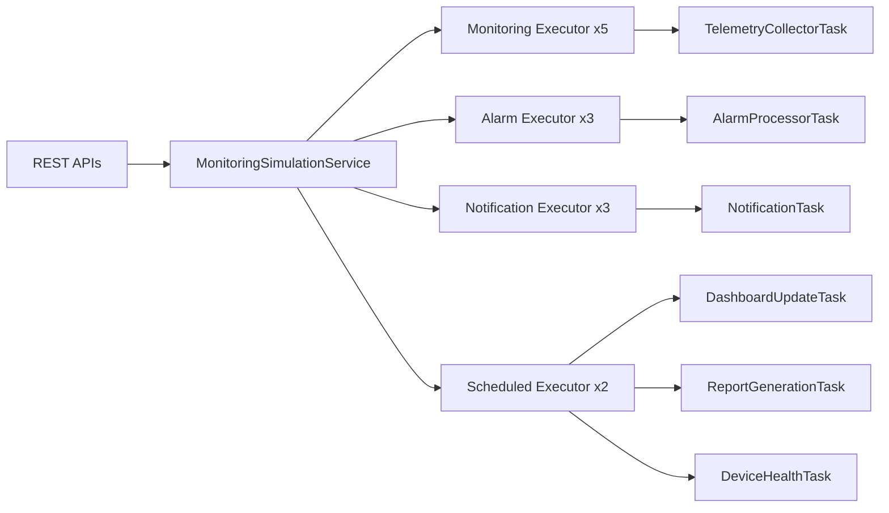

# ExecutorService Architecture

```mermaid
flowchart LR
    API[REST APIs] --> ORCH[MonitoringSimulationService]
    ORCH --> M1[Monitoring Executor x5]
    ORCH --> A1[Alarm Executor x3]
    ORCH --> N1[Notification Executor x3]
    ORCH --> S1[Scheduled Executor x2]

    M1 --> TCOL[TelemetryCollectorTask]
    A1 --> APROC[AlarmProcessorTask]
    N1 --> NTASK[NotificationTask]
    S1 --> DTASK[DashboardUpdateTask]
    S1 --> RTASK[ReportGenerationTask]
    S1 --> HTASK[DeviceHealthTask]
```
