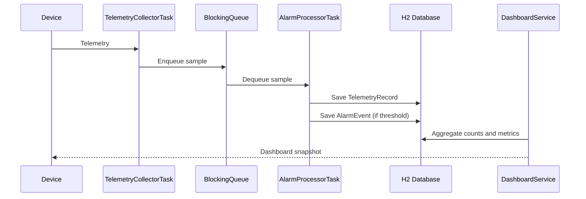

# Monitoring System Workflow

```mermaid
sequenceDiagram
    participant Device
    participant Producer as TelemetryCollectorTask
    participant Queue as BlockingQueue
    participant Consumer as AlarmProcessorTask
    participant DB as H2 Database
    participant Dashboard as DashboardService

    Device->>Producer: Telemetry
    Producer->>Queue: Enqueue sample
    Queue->>Consumer: Dequeue sample
    Consumer->>DB: Save TelemetryRecord
    Consumer->>DB: Save AlarmEvent (if threshold)
    Dashboard->>DB: Aggregate counts and metrics
    Dashboard-->>Device: Dashboard snapshot
```
