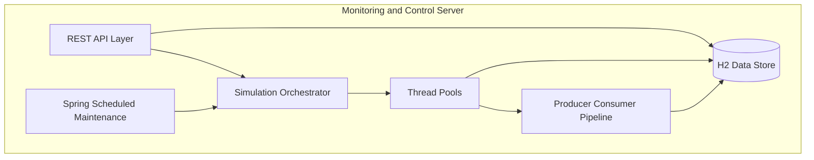

# NOC Concurrent Processing Architecture

```mermaid
flowchart TB
    subgraph NOC[Monitoring and Control Server]
      API[REST API Layer]
      SIM[Simulation Orchestrator]
      PC[Producer Consumer Pipeline]
      EXEC[Thread Pools]
      SCH[Spring Scheduled Maintenance]
      DB[(H2 Data Store)]
    end

    API --> SIM
    SIM --> EXEC
    EXEC --> PC
    PC --> DB
    EXEC --> DB
    SCH --> SIM
    API --> DB
```
