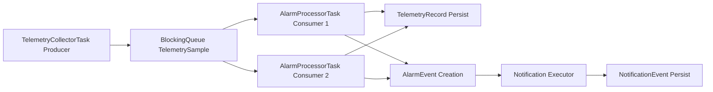

# Producer Consumer Flow

```mermaid
flowchart LR
    P[TelemetryCollectorTask Producer] --> Q[BlockingQueue TelemetrySample]
    Q --> C1[AlarmProcessorTask Consumer 1]
    Q --> C2[AlarmProcessorTask Consumer 2]
    C1 --> DB1[TelemetryRecord Persist]
    C2 --> DB1
    C1 --> ALM[AlarmEvent Creation]
    C2 --> ALM
    ALM --> NQ[Notification Executor]
    NQ --> NTFY[NotificationEvent Persist]
```
