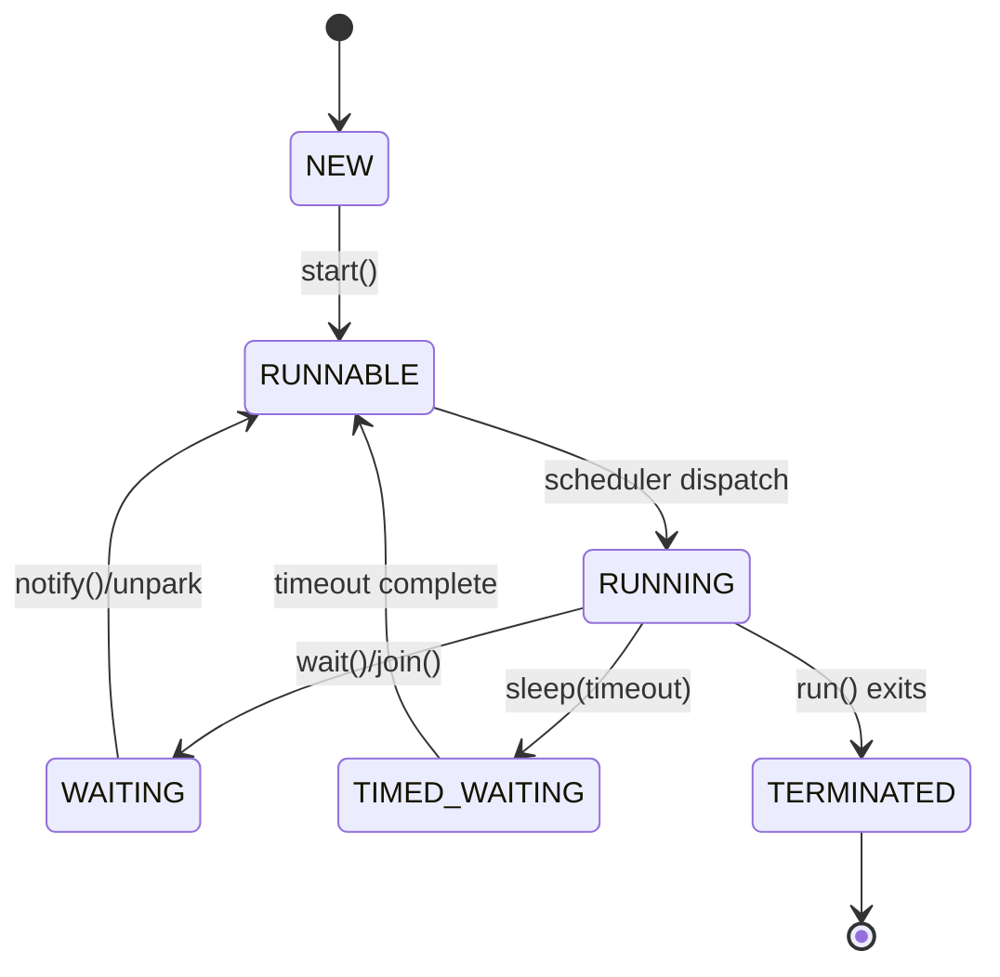

# Thread Lifecycle

```mermaid
stateDiagram-v2
    [*] --> NEW
    NEW --> RUNNABLE: start()
    RUNNABLE --> RUNNING: scheduler dispatch
    RUNNING --> WAITING: wait()/join()
    RUNNING --> TIMED_WAITING: sleep(timeout)
    WAITING --> RUNNABLE: notify()/unpark
    TIMED_WAITING --> RUNNABLE: timeout complete
    RUNNING --> TERMINATED: run() exits
    TERMINATED --> [*]
```
