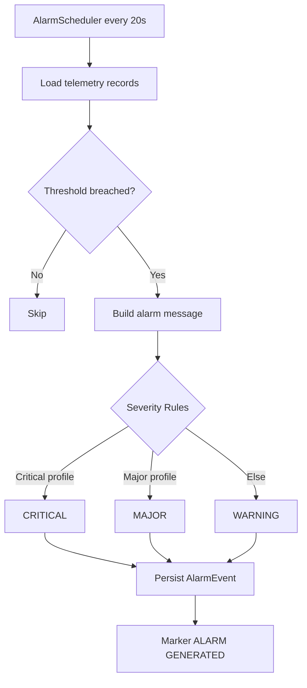

# Alarm Evaluation Flow

```mermaid
flowchart TD
  A[AlarmScheduler every 20s] --> B[Load telemetry records]
  B --> C{Threshold breached?}
  C -->|No| D[Skip]
  C -->|Yes| E[Build alarm message]
  E --> F{Severity Rules}
  F -->|Critical profile| G[CRITICAL]
  F -->|Major profile| H[MAJOR]
  F -->|Else| I[WARNING]
  G --> J[Persist AlarmEvent]
  H --> J
  I --> J
  J --> K[Marker ALARM GENERATED]
```
