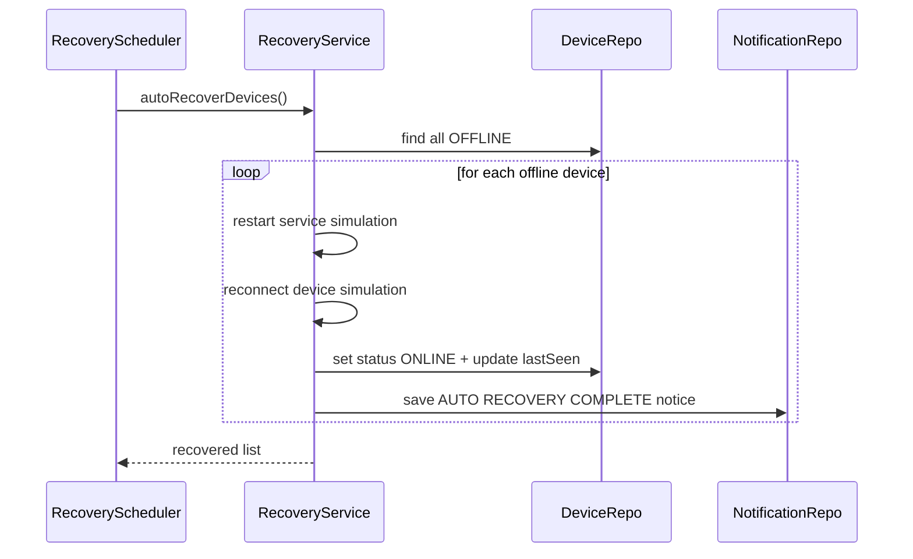

# Auto Recovery Workflow

```mermaid
sequenceDiagram
  participant RecoveryScheduler
  participant RecoveryService
  participant DeviceRepo
  participant NotificationRepo

  RecoveryScheduler->>RecoveryService: autoRecoverDevices()
  RecoveryService->>DeviceRepo: find all OFFLINE
  loop for each offline device
    RecoveryService->>RecoveryService: restart service simulation
    RecoveryService->>RecoveryService: reconnect device simulation
    RecoveryService->>DeviceRepo: set status ONLINE + update lastSeen
    RecoveryService->>NotificationRepo: save AUTO RECOVERY COMPLETE notice
  end
  RecoveryService-->>RecoveryScheduler: recovered list
```
