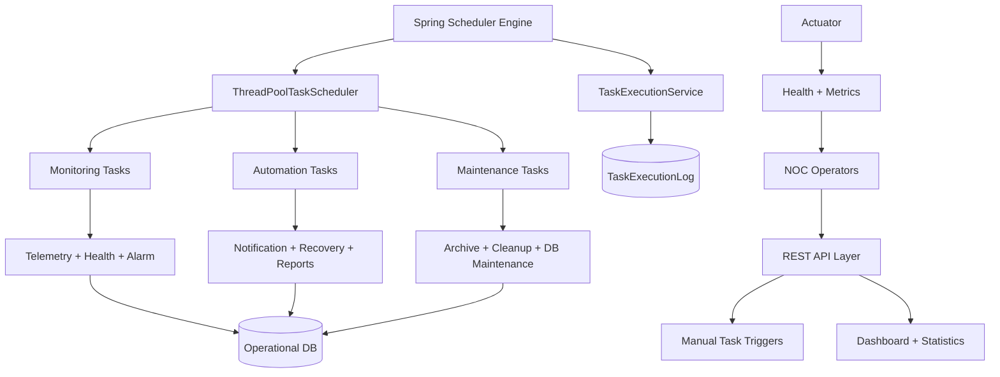

# Enterprise Scheduling Architecture

```mermaid
graph TB
  A[NOC Operators] --> B[REST API Layer]
  B --> C[Manual Task Triggers]
  B --> D[Dashboard + Statistics]

  E[Spring Scheduler Engine] --> F[ThreadPoolTaskScheduler]
  F --> G[Monitoring Tasks]
  F --> H[Automation Tasks]
  F --> I[Maintenance Tasks]

  G --> J[Telemetry + Health + Alarm]
  H --> K[Notification + Recovery + Reports]
  I --> L[Archive + Cleanup + DB Maintenance]

  J --> M[(Operational DB)]
  K --> M
  L --> M

  N[TaskExecutionService] --> O[(TaskExecutionLog)]
  E --> N

  P[Actuator] --> Q[Health + Metrics]
  Q --> A
```
