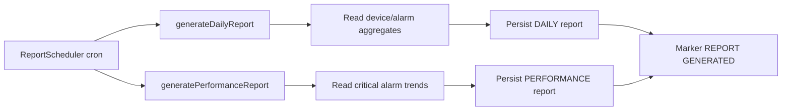

# Report Generation Flow

```mermaid
flowchart LR
  A[ReportScheduler cron] --> B[generateDailyReport]
  A --> C[generatePerformanceReport]
  B --> D[Read device/alarm aggregates]
  C --> E[Read critical alarm trends]
  D --> F[Persist DAILY report]
  E --> G[Persist PERFORMANCE report]
  F --> H[Marker REPORT GENERATED]
  G --> H
```
