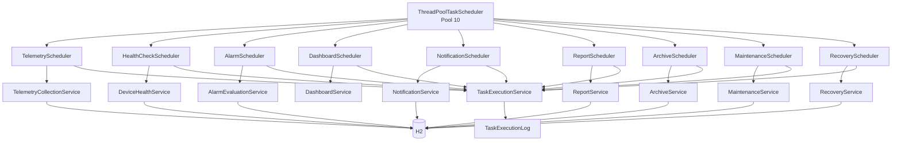

# Scheduler Architecture

```mermaid
graph TD
  A[ThreadPoolTaskScheduler<br/>Pool 10] --> B[TelemetryScheduler]
  A --> C[HealthCheckScheduler]
  A --> D[AlarmScheduler]
  A --> E[DashboardScheduler]
  A --> F[NotificationScheduler]
  A --> G[ReportScheduler]
  A --> H[ArchiveScheduler]
  A --> I[MaintenanceScheduler]
  A --> J[RecoveryScheduler]

  B --> K[TelemetryCollectionService]
  C --> L[DeviceHealthService]
  D --> M[AlarmEvaluationService]
  E --> N[DashboardService]
  F --> O[NotificationService]
  G --> P[ReportService]
  H --> Q[ArchiveService]
  I --> R[MaintenanceService]
  J --> S[RecoveryService]

  K --> DB[(H2)]
  L --> DB
  M --> DB
  O --> DB
  P --> DB
  Q --> DB
  R --> DB
  S --> DB

  T[TaskExecutionService] --> U[TaskExecutionLog]
  B --> T
  C --> T
  D --> T
  E --> T
  F --> T
  G --> T
  H --> T
  I --> T
  J --> T
```
