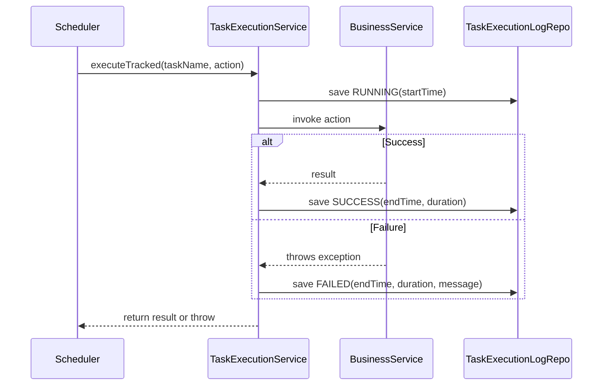

# Task Execution Flow

```mermaid
sequenceDiagram
  participant Scheduler
  participant TaskExecutionService
  participant BusinessService
  participant TaskExecutionLogRepo

  Scheduler->>TaskExecutionService: executeTracked(taskName, action)
  TaskExecutionService->>TaskExecutionLogRepo: save RUNNING(startTime)
  TaskExecutionService->>BusinessService: invoke action
  alt Success
    BusinessService-->>TaskExecutionService: result
    TaskExecutionService->>TaskExecutionLogRepo: save SUCCESS(endTime, duration)
  else Failure
    BusinessService-->>TaskExecutionService: throws exception
    TaskExecutionService->>TaskExecutionLogRepo: save FAILED(endTime, duration, message)
  end
  TaskExecutionService-->>Scheduler: return result or throw
```
