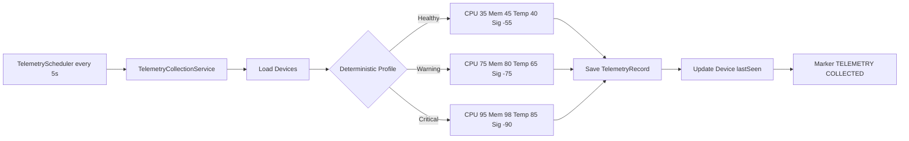

# Telemetry Collection Flow

```mermaid
flowchart LR
  A[TelemetryScheduler every 5s] --> B[TelemetryCollectionService]
  B --> C[Load Devices]
  C --> D{Deterministic Profile}
  D -->|Healthy| E[CPU 35 Mem 45 Temp 40 Sig -55]
  D -->|Warning| F[CPU 75 Mem 80 Temp 65 Sig -75]
  D -->|Critical| G[CPU 95 Mem 98 Temp 85 Sig -90]
  E --> H[Save TelemetryRecord]
  F --> H
  G --> H
  H --> I[Update Device lastSeen]
  I --> J[Marker TELEMETRY COLLECTED]
```
