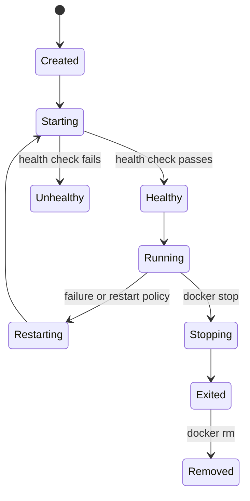

# Container Lifecycle

```mermaid
stateDiagram-v2
    [*] --> Created
    Created --> Starting
    Starting --> Healthy: health check passes
    Starting --> Unhealthy: health check fails
    Healthy --> Running
    Running --> Restarting: failure or restart policy
    Restarting --> Starting
    Running --> Stopping: docker stop
    Stopping --> Exited
    Exited --> Removed: docker rm
```

## Quick Explanation

Compose-managed services transition through startup and health states before reaching stable runtime.
