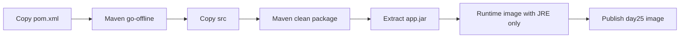

# Docker Build Flow

```mermaid
flowchart LR
    A[Copy pom.xml] --> B[Maven go-offline]
    B --> C[Copy src]
    C --> D[Maven clean package]
    D --> E[Extract app.jar]
    E --> F[Runtime image with JRE only]
    F --> G[Publish day25 image]
```

## Quick Explanation

Dependency resolution is cached before source copy, reducing rebuild time and producing a lean runtime image.
