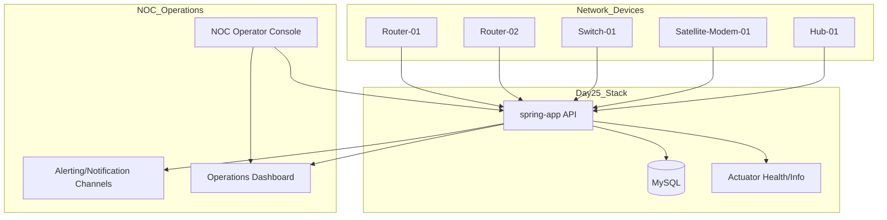

# Enterprise Deployment Architecture

```mermaid
graph TD
    subgraph NOC_Operations
        Operator[NOC Operator Console]
        Alerting[Alerting/Notification Channels]
        Dashboard[Operations Dashboard]
    end

    subgraph Day25_Stack
        API[spring-app API]
        DB[(MySQL)]
        ACT[Actuator Health/Info]
    end

    subgraph Network_Devices
        R1[Router-01]
        R2[Router-02]
        SW1[Switch-01]
        SM1[Satellite-Modem-01]
        HUB[Hub-01]
    end

    R1 --> API
    R2 --> API
    SW1 --> API
    SM1 --> API
    HUB --> API

    API --> DB
    API --> ACT
    API --> Dashboard
    API --> Alerting
    Operator --> Dashboard
    Operator --> API
```

## Quick Explanation

The Day-25 stack models a backend control-plane service that consumes device state and serves NOC operations interfaces.
