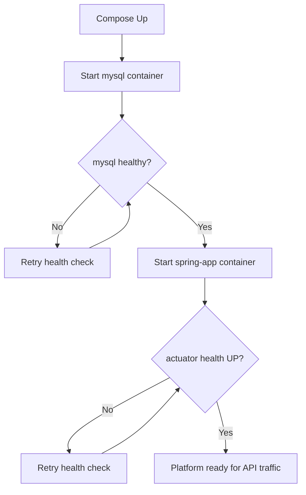

# Health Check Workflow

```mermaid
flowchart TD
    Start[Compose Up] --> MySQLStart[Start mysql container]
    MySQLStart --> MySQLHealth{mysql healthy?}
    MySQLHealth -- No --> WaitDB[Retry health check]
    WaitDB --> MySQLHealth
    MySQLHealth -- Yes --> StartApp[Start spring-app container]
    StartApp --> AppHealth{actuator health UP?}
    AppHealth -- No --> WaitApp[Retry health check]
    WaitApp --> AppHealth
    AppHealth -- Yes --> Ready[Platform ready for API traffic]
```

## Quick Explanation

Both infrastructure and application readiness are validated before smoke tests and operational checks begin.
