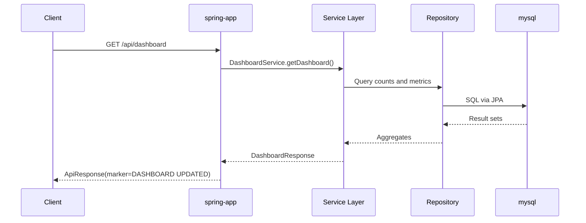

# Spring Boot Container Flow

```mermaid
sequenceDiagram
    participant C as Client
    participant A as spring-app
    participant S as Service Layer
    participant R as Repository
    participant M as mysql

    C->>A: GET /api/dashboard
    A->>S: DashboardService.getDashboard()
    S->>R: Query counts and metrics
    R->>M: SQL via JPA
    M-->>R: Result sets
    R-->>S: Aggregates
    S-->>A: DashboardResponse
    A-->>C: ApiResponse(marker=DASHBOARD UPDATED)
```

## Quick Explanation

The containerized app preserves standard layered architecture while exposing operational marker-based API contracts.
