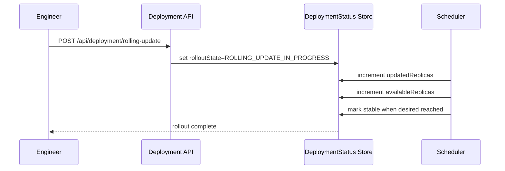

# Deployment Rollout Flow

```mermaid
sequenceDiagram
    participant Engineer
    participant API as Deployment API
    participant Store as DeploymentStatus Store
    participant Scheduler
    Engineer->>API: POST /api/deployment/rolling-update
    API->>Store: set rolloutState=ROLLING_UPDATE_IN_PROGRESS
    Scheduler->>Store: increment updatedReplicas
    Scheduler->>Store: increment availableReplicas
    Scheduler->>Store: mark stable when desired reached
    Store-->>Engineer: rollout complete
```
