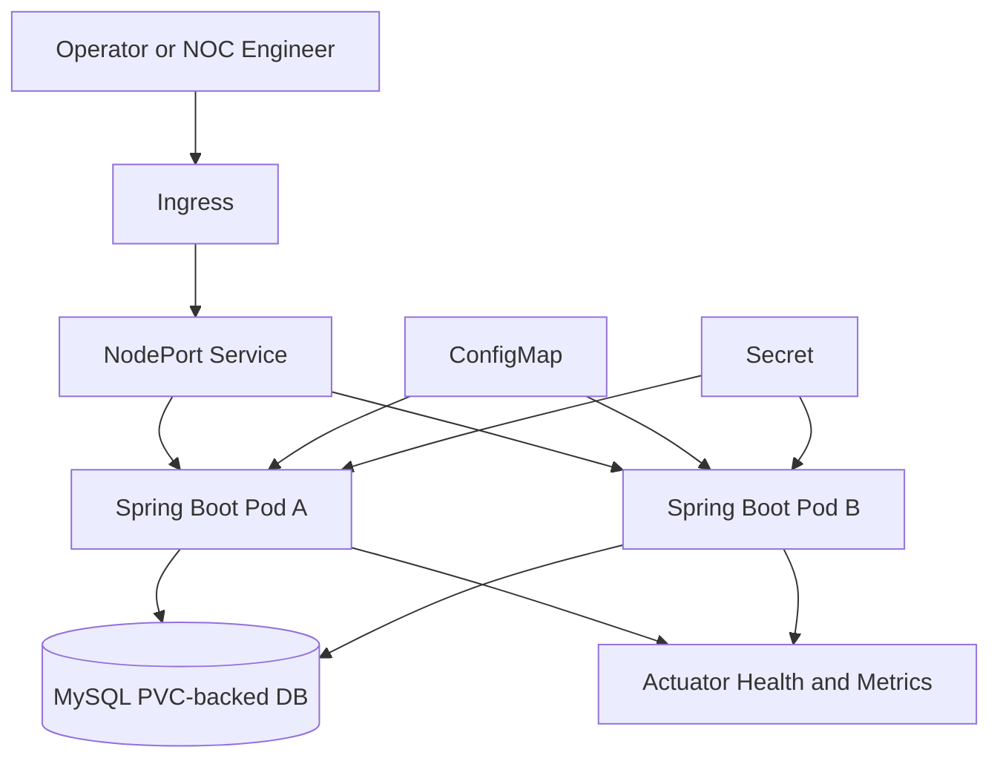

# Platform Architecture

```mermaid
graph TB
    User[Operator or NOC Engineer] --> Ingress[Ingress]
    Ingress --> Service[NodePort Service]
    Service --> App1[Spring Boot Pod A]
    Service --> App2[Spring Boot Pod B]
    App1 --> MySQL[(MySQL PVC-backed DB)]
    App2 --> MySQL
    App1 --> Actuator[Actuator Health and Metrics]
    App2 --> Actuator
    ConfigMap[ConfigMap] --> App1
    ConfigMap --> App2
    Secret[Secret] --> App1
    Secret --> App2
```
