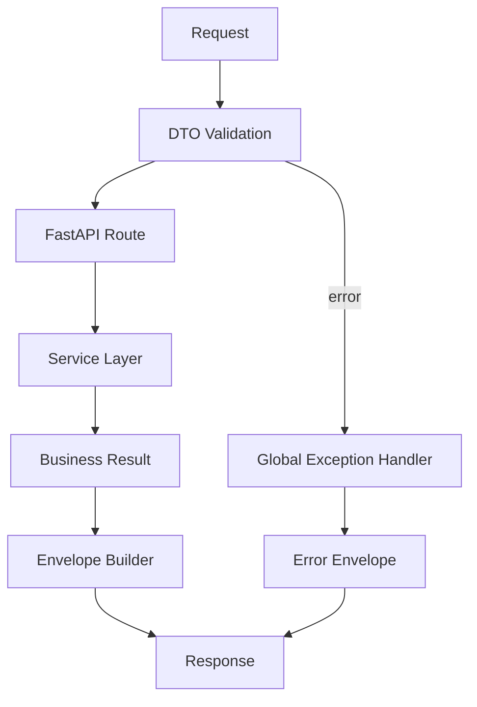

# API Request Lifecycle

```mermaid
flowchart TD
  Request --> DTO[DTO Validation]
  DTO --> Router[FastAPI Route]
  Router --> Service[Service Layer]
  Service --> Result[Business Result]
  Result --> Envelope[Envelope Builder]
  Envelope --> Response
  DTO -->|error| EH[Global Exception Handler]
  EH --> ErrorEnvelope[Error Envelope]
  ErrorEnvelope --> Response
```

Every API call passes through validation, routed service execution, and uniform response construction. Errors use the same envelope model.
