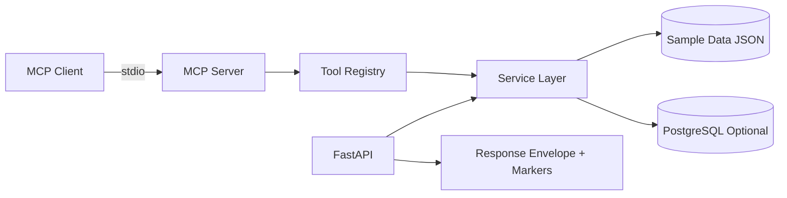

# Architecture Overview

```mermaid
flowchart LR
  Client[MCP Client] -->|stdio| MCPServer[MCP Server]
  MCPServer --> Registry[Tool Registry]
  Registry --> Services[Service Layer]
  Services --> Data[(Sample Data JSON)]
  Services --> DB[(PostgreSQL Optional)]
  APIGW[FastAPI] --> Services
  APIGW --> Envelope[Response Envelope + Markers]
```

The platform exposes the same services through MCP and HTTP. Deterministic responses are enforced through shared settings and envelope contracts.
