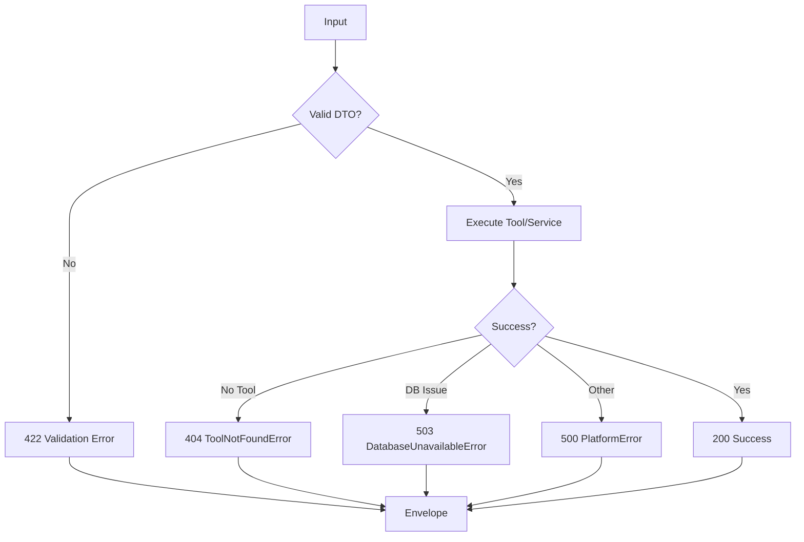

# Error Handling Flow

```mermaid
flowchart TD
  Input --> Validate{Valid DTO?}
  Validate -->|No| VErr[422 Validation Error]
  Validate -->|Yes| Execute[Execute Tool/Service]
  Execute --> Outcome{Success?}
  Outcome -->|No Tool| NotFound[404 ToolNotFoundError]
  Outcome -->|DB Issue| DBErr[503 DatabaseUnavailableError]
  Outcome -->|Other| GenErr[500 PlatformError]
  Outcome -->|Yes| OK[200 Success]
  VErr --> Envelope
  NotFound --> Envelope
  DBErr --> Envelope
  GenErr --> Envelope
  OK --> Envelope
```

Centralized exception handlers map platform failures to stable HTTP codes and envelope contracts.
