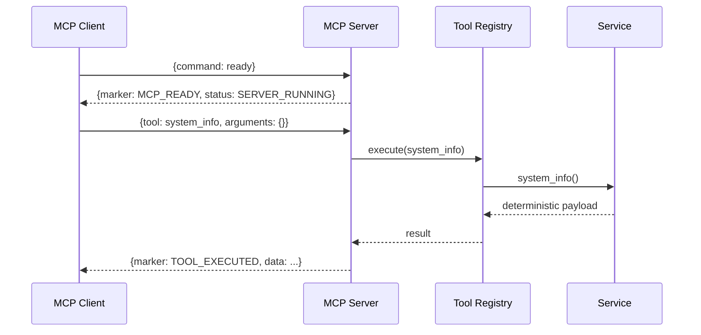

# MCP Stdio Sequence

```mermaid
sequenceDiagram
  participant C as MCP Client
  participant S as MCP Server
  participant T as Tool Registry
  participant SV as Service

  C->>S: {command: ready}
  S-->>C: {marker: MCP_READY, status: SERVER_RUNNING}
  C->>S: {tool: system_info, arguments: {}}
  S->>T: execute(system_info)
  T->>SV: system_info()
  SV-->>T: deterministic payload
  T-->>S: result
  S-->>C: {marker: TOOL_EXECUTED, data: ...}
```

The sequence demonstrates readiness and tool execution over stdio transport with marker-based responses.
