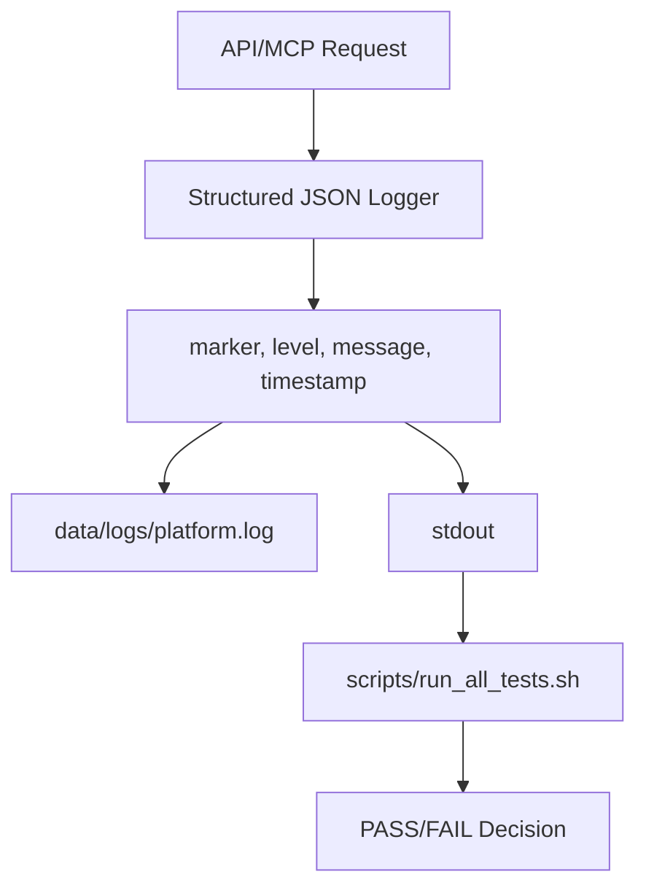

# Observability Logging Pipeline

```mermaid
flowchart TD
  APIReq[API/MCP Request] --> Logger[Structured JSON Logger]
  Logger --> Fields[marker, level, message, timestamp]
  Fields --> FileLog[data/logs/platform.log]
  Fields --> Console[stdout]
  Console --> Script[scripts/run_all_tests.sh]
  Script --> PASS[PASS/FAIL Decision]
```

Structured logging and marker assertions create deterministic observability for automation and troubleshooting.
