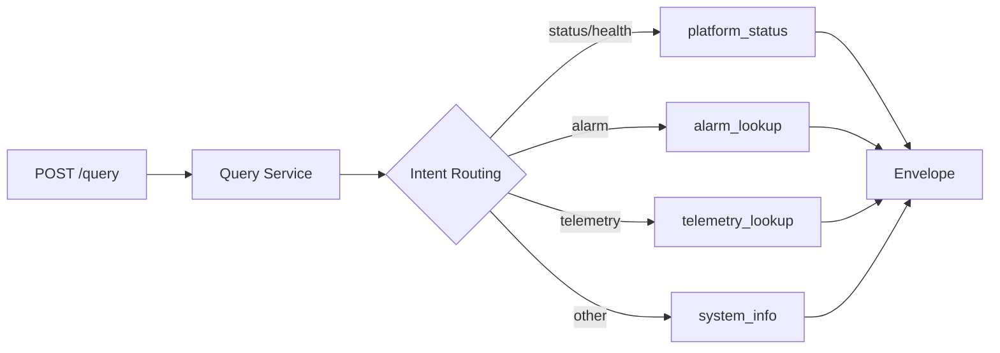

# Tool Orchestration Flow

```mermaid
flowchart LR
  Query[POST /query] --> Router[Query Service]
  Router --> Decision{Intent Routing}
  Decision -->|status/health| Platform[platform_status]
  Decision -->|alarm| Alarm[alarm_lookup]
  Decision -->|telemetry| Telemetry[telemetry_lookup]
  Decision -->|other| System[system_info]
  Platform --> Envelope
  Alarm --> Envelope
  Telemetry --> Envelope
  System --> Envelope
```

The query endpoint maps user intent to specific operational tools and returns deterministic marker-based outputs.
