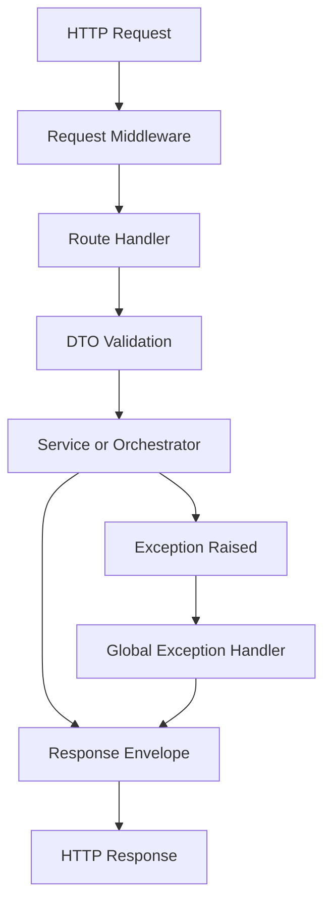

# API Request Lifecycle

```mermaid
flowchart TD
  In[HTTP Request] --> Mid[Request Middleware]
  Mid --> Route[Route Handler]
  Route --> DTO[DTO Validation]
  DTO --> Service[Service or Orchestrator]
  Service --> Env[Response Envelope]
  Env --> Out[HTTP Response]
  Service --> Ex[Exception Raised]
  Ex --> Handler[Global Exception Handler]
  Handler --> Env
```
