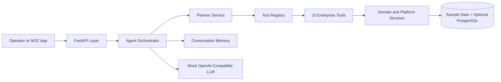

# Architecture Overview

```mermaid
flowchart LR
  Client[Operator or NOC App] --> API[FastAPI Layer]
  API --> Orchestrator[Agent Orchestrator]
  Orchestrator --> Planner[Planner Service]
  Planner --> Registry[Tool Registry]
  Registry --> Tools[10 Enterprise Tools]
  Orchestrator --> Memory[Conversation Memory]
  Orchestrator --> LLM[Mock OpenAI-Compatible LLM]
  Tools --> Services[Domain and Platform Services]
  Services --> Data[(Sample Data + Optional PostgreSQL)]
```
