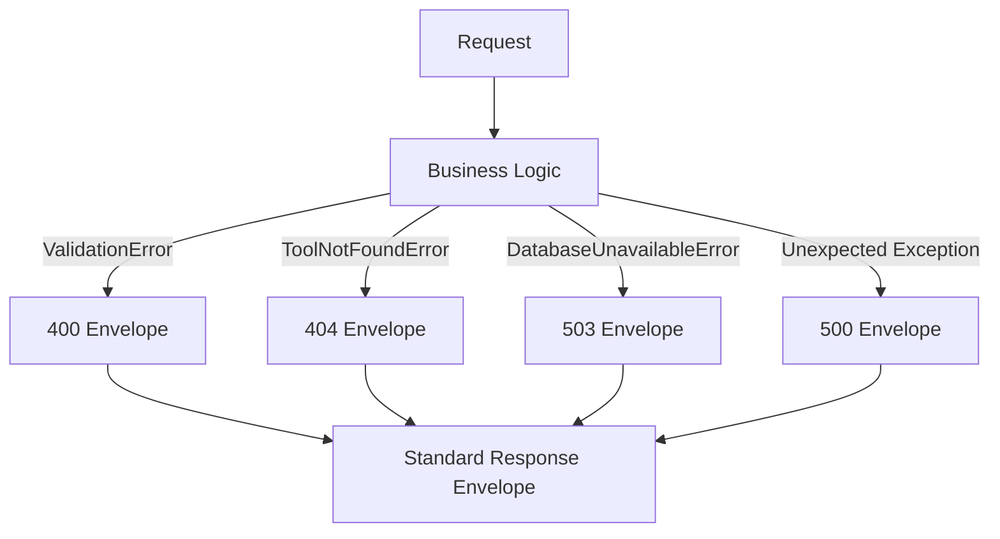

# Error Handling Flow

```mermaid
flowchart TD
  Req[Request] --> Logic[Business Logic]
  Logic -->|ValidationError| V[400 Envelope]
  Logic -->|ToolNotFoundError| T[404 Envelope]
  Logic -->|DatabaseUnavailableError| D[503 Envelope]
  Logic -->|Unexpected Exception| U[500 Envelope]
  V --> Resp[Standard Response Envelope]
  T --> Resp
  D --> Resp
  U --> Resp
```
