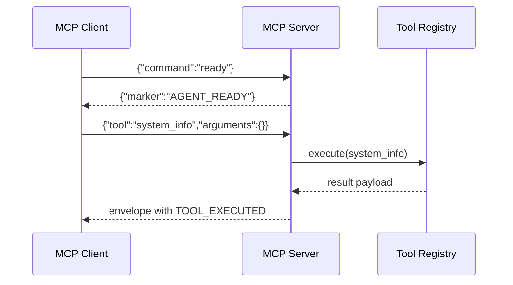

# MCP Stdio Sequence

```mermaid
sequenceDiagram
  participant C as MCP Client
  participant S as MCP Server
  participant R as Tool Registry

  C->>S: {"command":"ready"}
  S-->>C: {"marker":"AGENT_READY"}
  C->>S: {"tool":"system_info","arguments":{}}
  S->>R: execute(system_info)
  R-->>S: result payload
  S-->>C: envelope with TOOL_EXECUTED
```
