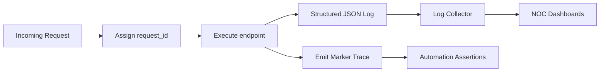

# Observability Logging Pipeline

```mermaid
flowchart LR
  Req[Incoming Request] --> Ctx[Assign request_id]
  Ctx --> Exec[Execute endpoint]
  Exec --> Log[Structured JSON Log]
  Log --> Sink[Log Collector]
  Sink --> Dash[NOC Dashboards]
  Exec --> Marker[Emit Marker Trace]
  Marker --> QA[Automation Assertions]
```
