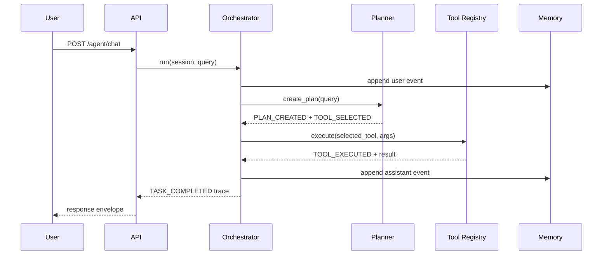

# Tool Orchestration Flow

```mermaid
sequenceDiagram
  participant U as User
  participant A as API
  participant O as Orchestrator
  participant P as Planner
  participant T as Tool Registry
  participant M as Memory

  U->>A: POST /agent/chat
  A->>O: run(session, query)
  O->>M: append user event
  O->>P: create_plan(query)
  P-->>O: PLAN_CREATED + TOOL_SELECTED
  O->>T: execute(selected_tool, args)
  T-->>O: TOOL_EXECUTED + result
  O->>M: append assistant event
  O-->>A: TASK_COMPLETED trace
  A-->>U: response envelope
```
